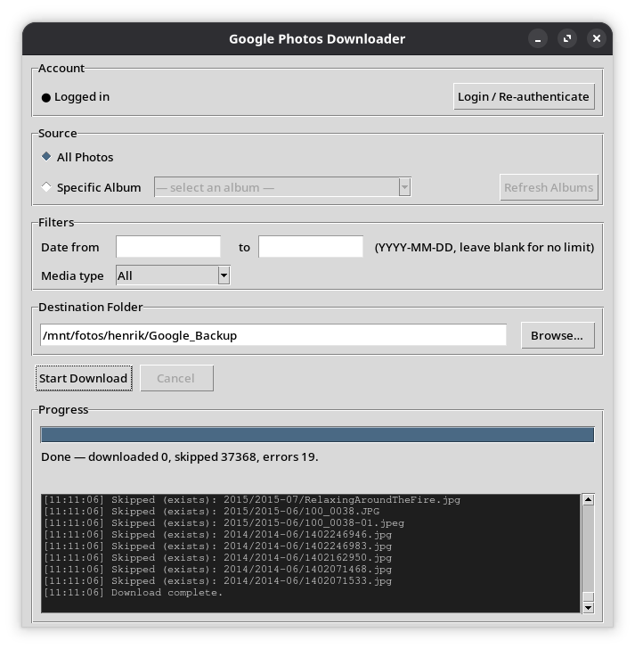

# Google Photos Downloader

A desktop GUI app that downloads your entire Google Photos library to local storage — **no API key or Google Cloud project required**.

It uses a one-time browser login (Playwright) to authenticate, then talks directly to the same internal web API that the Google Photos website uses, giving access to your full library with original-quality files.



---

## Why this exists

Google removed the broad `photoslibrary.readonly` OAuth scope in March 2025, breaking every backup tool that relied on the official API. The only remaining official option (the Picker API) requires the user to manually click photos in a browser — useless for bulk backup.

This app works around the restriction by:
1. Using a **persistent Chromium session** (Playwright) to log in once, just like using the website normally
2. Calling the **undocumented batchexecute web API** (`gpwc` library) to enumerate your full library
3. Downloading each file at **original full resolution** directly from Google's CDN

---

## Features

- **Full library download** — all photos and videos, original quality
- **Album download** — browse and download specific albums
- **Date range filter** — narrow downloads to a specific date range
- **Media type filter** — photos only, videos only, or both
- **Smart deduplication** — skip-by-`media_key` manifest (not filename), so two different photos with the same name are never confused
- **Date-organised output** — files saved as `YYYY/YYYY-MM/filename` automatically
- **Resume support** — interrupted downloads pick up where they left off
- **Pipelined** — downloading starts immediately while the library is still being enumerated
- **Sleep prevention** — blocks system sleep/idle via `systemd-inhibit` for the duration of the download
- **Clean cancellation** — cancel mid-job without leaving partial files

---

## Requirements

- Python 3.10+
- A real Google account with photos
- Linux with systemd (tested on Manjaro/Arch; should work on any systemd distro)

> **macOS/Windows:** Playwright works on both, and `systemd-inhibit` is simply skipped on non-systemd systems. The rest of the app should work — untested.

---

## Installation

```bash
git clone https://github.com/xhensen/gphotohandler.git
cd gphotohandler

python3 -m venv ~/gphotohandler-venv
source ~/gphotohandler-venv/bin/activate

pip install -r requirements.txt
playwright install chromium
```

---

## Running

```bash
~/gphotohandler-venv/bin/python main.py
```

Or with the venv activated:

```bash
python main.py
```

---

## First-time setup

1. Click **Login / Re-authenticate**
2. A Chromium browser window opens — sign into your Google account normally
3. Once you land on Google Photos, the window closes automatically
4. Status changes to **● Logged in** — you're ready

The session is saved to `~/.gphotohandler/` and reused on future runs. You only need to log in again if cookies expire (roughly every few months) or if you explicitly re-authenticate.

---

## Usage

| Setting | Description |
|---|---|
| **All Photos** | Downloads your entire library |
| **Specific Album** | Downloads one album — click *Refresh Albums* first to populate the dropdown |
| **Date from / to** | Optional `YYYY-MM-DD` range filter; leave blank for no limit |
| **Media type** | All / Photos only / Videos only |
| **Destination Folder** | Where files will be saved; organised into `YYYY/YYYY-MM/` subfolders automatically |

Hit **Start Download** — progress is shown live. Click **Cancel** to stop cleanly.

---

## Output structure

```
/your/destination/
├── 2023/
│   ├── 2023-07/
│   │   ├── IMG_4821.jpg
│   │   └── VID_20230715.mp4
│   └── 2023-12/
│       └── IMG_9302.jpg
├── 2024/
│   └── 2024-01/
│       └── IMG_0001.jpg
└── .gphoto_manifest.json   ← tracks downloaded media_keys for resume/dedup
```

---

## How it works

```
Tkinter UI (main thread)
    └── threading.Thread
            ├── Playwright (headless=False on first run)
            │     └── persistent Chromium profile → cookies.txt
            └── gpwc batchexecute API (requests + cookies)
                  └── GetLibraryPageByTakenDate / GetAlbumPage (paginated)
                        └── GetBatchMediaInfo (filenames)
                              └── GET base_url=d / =dv → stream to disk
```

- **Auth:** `auth.py` — Playwright opens a real browser, waits for login, saves cookies as Netscape `cookies.txt` to `~/.gphotohandler/`
- **Enumeration:** `client.py` — wraps [`gpwc`](https://github.com/xob0t/google_photos_web_client), paginates the library/album API, resolves filenames via batch info calls
- **Download:** `downloader.py` — streams `base_url + "=d"` (photos) or `"=dv"` (videos), manages the manifest
- **UI:** `main.py` — Tkinter GUI, `root.after()` progress polling, systemd-inhibit sleep prevention

---

## Download quality

| Type | URL suffix | Quality |
|---|---|---|
| Photo | `=d` | Original full resolution, all EXIF (except GPS stripped by Google) |
| Video | `=dv` | High-quality transcode (not always bit-for-bit original — depends on upload method) |

---

## Known limitations

- **`gpwc` is reverse-engineered** — the batchexecute RPC IDs could change if Google redeploys. If enumeration silently returns zero items after a Google update, check for a [new release of gpwc](https://github.com/xob0t/google_photos_web_client).
- **Sequential downloads** — one file at a time. This is intentional to reduce the chance of rate-limiting or bot detection. Very large libraries will take a long time.
- **Session expiry** — cookies last a few months. If you get a connection error, click *Login / Re-authenticate*.
- **Video originals** — the `=dv` download is a high-quality re-encode, not always the raw original file. For guaranteed originals, use Google Takeout manually.

---

## Dependencies

| Package | Purpose |
|---|---|
| `playwright` | Browser automation for login |
| `playwright-stealth` | Reduces bot-detection signals |
| `gpwc` (from GitHub) | Reverse-engineered Google Photos batchexecute API client |
| `requests` | HTTP downloads |
| `lxml` | HTML parsing (used by gpwc) |

---

## Privacy & security

- No data is sent anywhere except to Google's own servers.
- Credentials are stored locally in `~/.gphotohandler/` (cookies.txt + Chromium profile).
- The app has no network functionality beyond what is needed to talk to Google Photos.

---

## License

MIT
